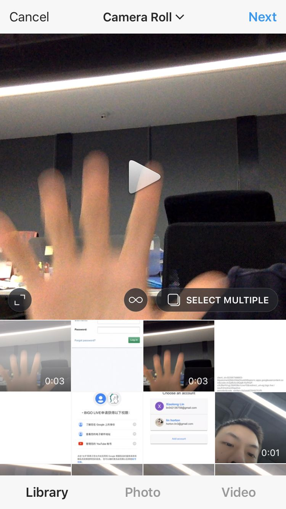

## TMShareDemo

 


#### Description:

* An example to show the usage of YouTube and instagram Api.**(Authorizaton, Login, Share Video)**

#### Usage:

###### Download Ways:

* Github:</br>git clone https://github.com/wfxiaolong/STWebViewController.git

###### Code:

```
#import "BLShareVideoModel.h"


#pragma mark Instagram

- (void)instagramAuthrisation {
    __weak typeof(self) weakSelf = self;
    [InstagramAuthViewController intagramAuth:self resHandler:^(InstagramAuthResult authResult, NSString *token) {
        [weakSelf outputText:[NSString stringWithFormat:@"AuthInstagram Result: %ld \n Get Token:", (long)authResult, token]];
    }];
}

- (void)instagramUploadVideo {
    NSString * videoPath = [[NSBundle mainBundle] pathForResource:@"test" ofType:@"mov"];
    [BLShareVideoModel shareVideoToInstagramWithFilePath:videoPath title:@"test" resHandler:^(BLShareVideoResCode shareRes) {}];
}

- (void)instagramGetProfile {
    [BLShareVideoModel openInstagramUserPage:@"xlongl" resHandler:^(BLShareVideoResCode shareRes) {}];
}

#pragma mark Youtube

- (void)youTubeAuthrization {
    __weak typeof(self) weakSelf = self;
    [[YouTubeControlModel shareInstance] signIn:^(OIDAuthState *result, NSError *error) {
        if (error != nil) {
            [weakSelf outputText:error.description];
        } else {
            [weakSelf outputText:result.description];
        }
    }];
}

- (void)youTubeUploadVideo {
    __weak typeof(self) weakSelf = self;
    NSString * videoPath = [[NSBundle mainBundle] pathForResource:@"test" ofType:@"mov"];
    [BLShareVideoModel shareVideoToYouTuBeWithFilePath:videoPath title:@"Video from TGShareDemo" description:@"describe from TGShareDemo" processHandler:^(unsigned long long total, unsigned long long read) {
        [weakSelf outputText:[NSString stringWithFormat:@"Upload file -- Total Length:%llu Read:%llu", total, read]];
    } resultHandler:^(NSError *error, GTLRYouTube_Video *video) {
        if (error != nil) {
            [weakSelf outputText:error.description];
        } else {
            [weakSelf outputText:[NSString stringWithFormat:@"Uploaded Success! Title:%@", video.snippet.title]];
        }
    }];
}

- (void)youTubeOpenProfile {
    [BLShareVideoModel openYoutubeUserPage:@"xiaolonglin" fromVC:self];
}

```

#### The demo's result:
<hr>





#### License
<hr>

TMShareModel is under MIT License. See LICENSE file for more info from <a href="https://opensource.org/licenses/mit-license.php">here</a>;

